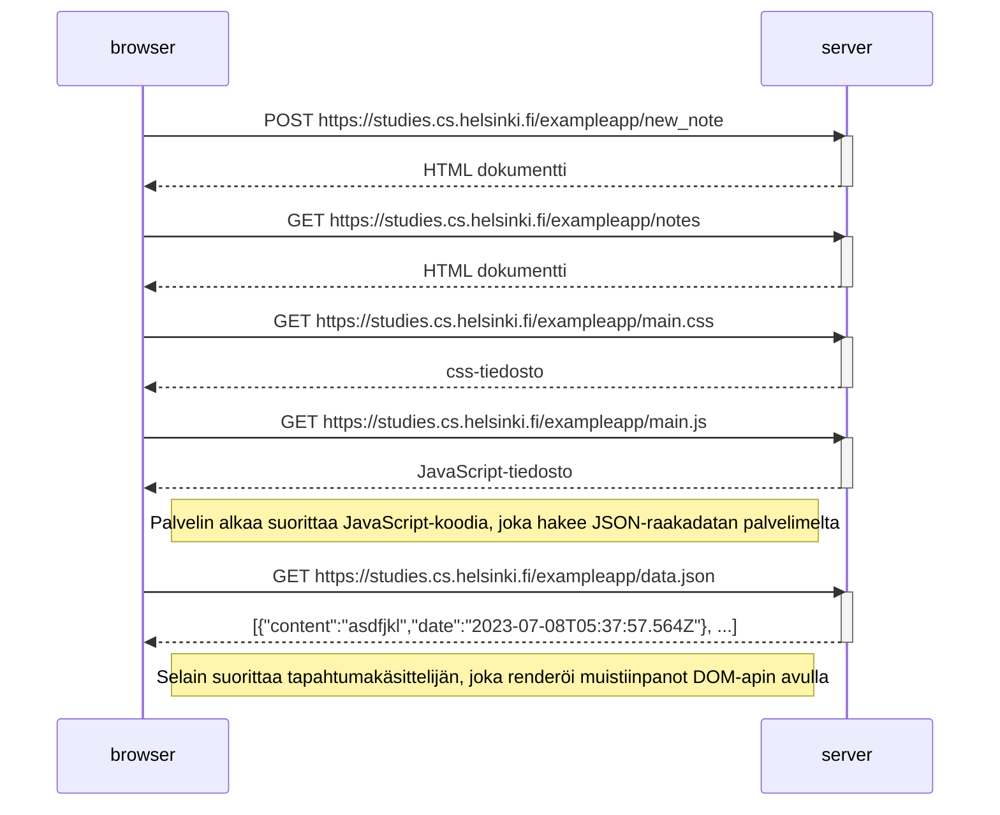

```mermaid
sequenceDiagram
  participant browser
  participant server

  browser->>server: POST https://studies.cs.helsinki.fi/exampleapp/new_note
  activate server
  server-->>browser: HTML dokumentti
  deactivate server

  browser->>server: GET https://studies.cs.helsinki.fi/exampleapp/notes
  activate server
  server-->>browser: HTML dokumentti
  deactivate server
    
  browser->>server: GET https://studies.cs.helsinki.fi/exampleapp/main.css
  activate server
  server-->>browser: css-tiedosto
  deactivate server
    
  browser->>server: GET https://studies.cs.helsinki.fi/exampleapp/main.js
  activate server
  server-->>browser: JavaScript-tiedosto
  deactivate server

  Note right of browser: Palvelin alkaa suorittaa JavaScript-koodia, joka hakee JSON-raakadatan palvelimelta
    
  browser->>server: GET https://studies.cs.helsinki.fi/exampleapp/data.json
  activate server
  server-->>browser: [{"content":"asdfjkl","date":"2023-07-08T05:37:57.564Z"}, ...]
  deactivate server    

  Note right of browser: Selain suorittaa tapahtumakäsittelijän, joka renderöi muistiinpanot DOM-apin avulla

```
