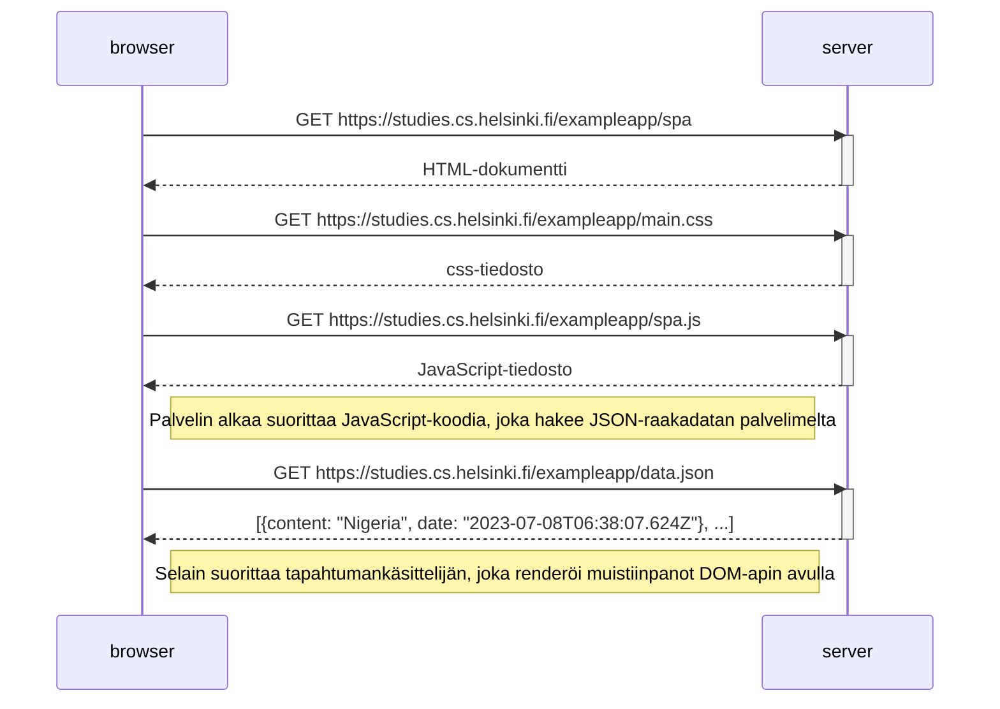

```mermaid

sequenceDiagram
  participant browser
  participant server

  browser->>server: GET https://studies.cs.helsinki.fi/exampleapp/spa
  activate server
  server-->>browser: HTML-dokumentti
  deactivate server

  browser->>server: GET https://studies.cs.helsinki.fi/exampleapp/main.css
  activate server
  server-->>browser: css-tiedosto
  deactivate server

  browser->>server: GET https://studies.cs.helsinki.fi/exampleapp/spa.js
  activate server
  server-->>browser: JavaScript-tiedosto
  deactivate server

  Note right of browser: Palvelin alkaa suorittaa JavaScript-koodia, joka hakee JSON-raakadatan palvelimelta

  browser->>server: GET https://studies.cs.helsinki.fi/exampleapp/data.json
  activate server
  server-->>browser: [{content: "Nigeria", date: "2023-07-08T06:38:07.624Z"}, ...]
  deactivate server

  Note right of browser: Selain suorittaa tapahtumankäsittelijän, joka renderöi muistiinpanot DOM-apin avulla

```
